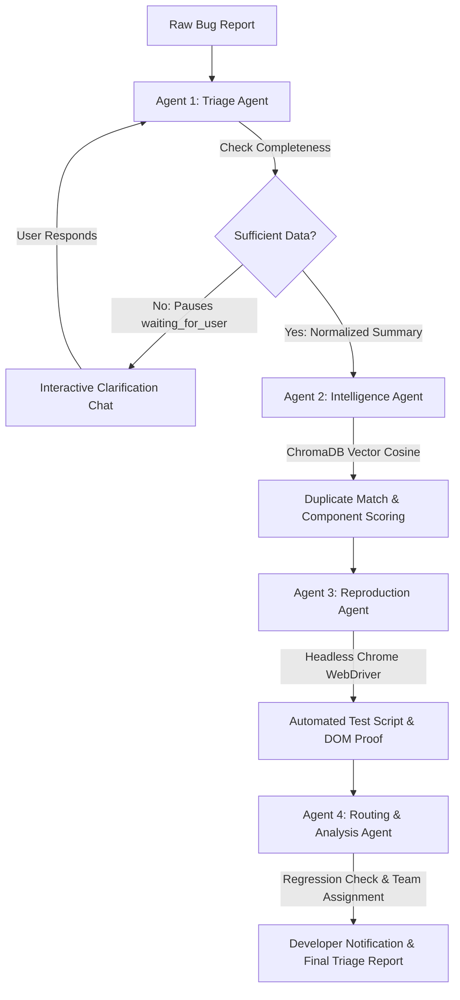

# BugTriage.ai: Autonomous Multi-Agent Software Bug Triage (GENAI-23)

[](https://fastapi.tiangolo.com)
[](https://nextjs.org)
[](https://www.postgresql.org/)
[](https://www.trychroma.com/)
[](https://www.selenium.dev/)
[](https://www.docker.com/)

An intelligent full-stack autonomous web platform that orchestrates **4 specialized AI agents** to ingest, normalize, detect duplicates, reproduce in a headless browser, and route software bug reports in real time.

---

## 1. Core Agent Pipeline



### The 4 Specialized Agents:
1. **Triage Agent (`agents/triage_agent.py`)**:
   - Parses unstructured text from Slack, email, or tickets.
   - Extracts structured steps to reproduce, expected result, actual result, and environment.
   - Performs completeness validation. If vital parameters are missing, pauses the pipeline and issues targeted clarifying questions.
2. **Intelligence Agent (`agents/intelligence_agent.py`)**:
   - Computes high-dimensional semantic embeddings.
   - Queries ChromaDB vector store for existing duplicate bugs with cosine similarity percentage.
   - Maps defects to system architectural components with confidence scoring and classifies severity (`critical|high|medium|low`) and priority (`P0|P1|P2|P3`).
3. **Reproduction Agent (`agents/reproduction_agent.py`)**:
   - Synthesizes an executable Python Selenium WebDriver 4 script.
   - Runs headless execution in browser test harnesses, capturing DOM screenshots, DevTools console traces, and HAR network errors.
4. **Routing & Analysis Agent (`agents/routing_agent.py`)**:
   - Performs historical regression analysis (detecting release updates and sudden regressions).
   - Routes the ticket to the owning engineering team and designates the lead developer.
   - Compiles an executive Markdown triage report with actionable remediation check-lists.

---

## 2. Technology Stack

- **Frontend**: Next.js 14 (App Router) + TypeScript + Tailwind CSS + Lucide Icons
- **Backend**: FastAPI (Python 3.11+) + Pydantic v2 + Server-Sent Events (SSE)
- **Database & ORM**: PostgreSQL / SQLite + SQLAlchemy 2.0 (Async) + Alembic migrations
- **Vector Database**: ChromaDB (Persistent client) + Semantic cosine similarity
- **Browser Automation**: Selenium 4 + Chrome Headless
- **AI & LLM Services**: Groq (`llama-3.3-70b-versatile`), OpenAI (`gpt-4o`), Google Gemini API, and smart deterministic fallback for offline/demo modes

---

## 3. Project Structure

```
aimihack/
├── backend/
│   ├── app/
│   │   ├── main.py                 # FastAPI application & lifespan
│   │   ├── config.py               # Pydantic BaseSettings
│   │   ├── database.py             # Async/Sync SQLAlchemy engine & session
│   │   ├── models/                 # SQLAlchemy models (User, Bug, TriageRun, AgentAction, etc.)
│   │   ├── schemas/                # Strict Pydantic contracts for all 4 agents & endpoints
│   │   ├── api/                    # Routers: auth, bugs, triage, admin
│   │   ├── agents/                 # Triage, Intelligence, Reproduction, Routing & Orchestrator
│   │   ├── services/               # Vector store, LLM, Embeddings, Selenium runner
│   │   └── utils/                  # JWT auth, bcrypt hashing, role dependencies
│   ├── alembic/                    # Database migration versions
│   ├── data/
│   │   ├── components.json         # 9 Realistic system components with teams
│   │   └── sample_bugs.json        # 12 Seed bugs (incomplete, duplicate, regression, complete)
│   ├── static/evidence/            # Browser screenshots and test traces
│   ├── requirements.txt            # Python dependencies
│   └── Dockerfile                  # Container definition
│
├── frontend/
│   ├── app/
│   │   ├── (auth)/login/page.tsx   # Login with 1-click demo personas
│   │   ├── (auth)/register/page.tsx# User registration
│   │   ├── dashboard/page.tsx      # Metrics, triage queue, active bugs
│   │   ├── bugs/
│   │   │   ├── page.tsx            # Bug registry with filters
│   │   │   ├── new/page.tsx        # Bug submission (raw or structured)
│   │   │   └── [id]/page.tsx       # Live SSE triage command center & evidence
│   │   ├── demo/page.tsx           # 4 One-click showcase demo scenarios
│   │   ├── admin/page.tsx          # Architectural components & accuracy metrics
│   │   ├── layout.tsx              # Modern dark theme layout & Navbar
│   │   └── globals.css             # Glassmorphism & custom gradients
│   ├── components/
│   │   ├── TriageProgress.tsx      # Real-time multi-agent progression bar
│   │   ├── ClarificationChat.tsx   # Interactive chat loop for missing info
│   │   ├── DuplicateCard.tsx       # Side-by-side comparison & confirmation
│   │   ├── EvidenceGallery.tsx     # Screenshots, console logs, Selenium script
│   │   ├── AgentReasoning.tsx      # Expandable rationale inspector for all agents
│   │   ├── FeedbackModal.tsx       # Developer rating & telemetry system
│   │   └── BugForm.tsx             # Tabbed submission form with presets
│   ├── lib/
│   │   ├── api.ts                  # Fetch API client & SSE stream URLs
│   │   └── auth-context.tsx        # React context for auth & persona switching
│   └── Dockerfile
│
├── docker-compose.yml              # Unified PostgreSQL + Backend + Frontend stack
├── .env.example                    # Environment variable template
└── README.md
```

---

## 4. Quick Start Guide

### Option A: Local Development

#### 1. Backend Setup
```bash
cd backend

# Create and activate virtual environment
python -m venv venv
# Windows:
.\venv\Scripts\activate
# Linux/macOS:
source venv/bin/activate

# Install dependencies
pip install -r requirements.txt

# Run migrations (auto-creates bugtriage.db)
alembic upgrade head

# Start FastAPI server
uvicorn app.main:app --reload --host 127.0.0.1 --port 8000
```
*Backend Swagger Docs will be accessible at: `http://localhost:8000/docs`*

#### 2. Frontend Setup
```bash
cd frontend

# Install dependencies
npm install

# Start Next.js development server
npm run dev
```
*Frontend Application will be accessible at: `http://localhost:3000`*

---

### Option B: Unified Docker Compose

Run the entire system (PostgreSQL 15, FastAPI, Next.js 14) with a single command:

```bash
docker-compose up --build
```

---

## 5. Demo Personas & Testing Scenarios

### Default Demo Credentials (Pre-seeded)
| Persona | Email | Password | Role Description |
|---|---|---|---|
| **Admin** | `admin@bugtriage.ai` | `Password123!` | System architecture, component management & telemetry |
| **Developer** | `dev.auth@bugtriage.ai` | `Password123!` | Inspects reproduction evidence, test scripts, leaves feedback |
| **Reporter** | `reporter@bugtriage.ai` | `Password123!` | Submits new raw bug reports and answers clarifications |

*Note: You can also switch personas instantly via the top navigation bar dropdown.*

### 4 Interactive Showcase Scenarios (`/demo`)
Navigate to `http://localhost:3000/demo` to trigger:
1. **Scenario 1: Incomplete Report & Clarification Pause**:
   - Submits `Login broken`
   - Triage Agent identifies missing steps & environment, sets `status = waiting_for_user`, and posts questions in the chat.
   - Reply directly in the chat to resume the pipeline!
2. **Scenario 2: Semantic Duplicate Detection**:
   - Submits varied-wording Google SSO failure report.
   - Intelligence Agent matches existing ticket via ChromaDB with >85% similarity score.
   - Side-by-side comparison appears with 1-click "Confirm Duplicate".
3. **Scenario 3: Automated Reproduction & Visual Evidence**:
   - Submits avatar upload defect.
   - Reproduction Agent generates an executable Selenium script, runs headless test harness, captures screenshot proof, and logs DevTools console traces.
4. **Scenario 4: Full Pipeline Regression & Routing**:
   - Submits checkout 500 error after deployment.
   - Pipeline orchestrates all 4 agents, flags active regression, routes to Monetization Team developer, and compiles executive markdown summary.

---

## 6. API Endpoints Reference

| Method | Endpoint | Description |
|---|---|---|
| `POST` | `/api/auth/register` | Register new user |
| `POST` | `/api/auth/login` | Login and receive JWT access token |
| `GET` | `/api/auth/me` | Fetch authenticated user profile |
| `POST` | `/api/bugs` | Create bug report (embeds into vector store) |
| `GET` | `/api/bugs` | List bugs with filters (`status`, `severity`, `search`) |
| `GET` | `/api/bugs/{id}` | Detailed bug view with actions, duplicate matches & evidence |
| `PATCH`| `/api/bugs/{id}` | Update bug metadata or assigned developer |
| `POST` | `/api/bugs/{id}/clarify` | Submit answer to clarifying questions (resumes pipeline) |
| `POST` | `/api/bugs/{id}/confirm-duplicate` | Confirm or reject duplicate match |
| `POST` | `/api/triage/{bug_id}/start` | Trigger 4-agent sequential triage pipeline |
| `GET` | `/api/triage/{bug_id}/stream` | Server-Sent Events (SSE) real-time progression stream |
| `GET` | `/api/triage/{bug_id}/report` | Retrieve full triage report & markdown summary |
| `GET` | `/api/components` | List registered architectural components |
| `POST` | `/api/components` | Create architectural component (Admin) |
| `POST` | `/api/feedback` | Submit developer accuracy rating (1-5) |
| `GET` | `/api/admin/stats` | Telemetry metrics and accuracy averages |
| `POST` | `/api/admin/seed-demo` | Seed components and sample bugs into ChromaDB |

---

## 7. License
Distributed under the MIT License. Developed for the Intelligent Bug Triage Hackathon (GENAI-23).
